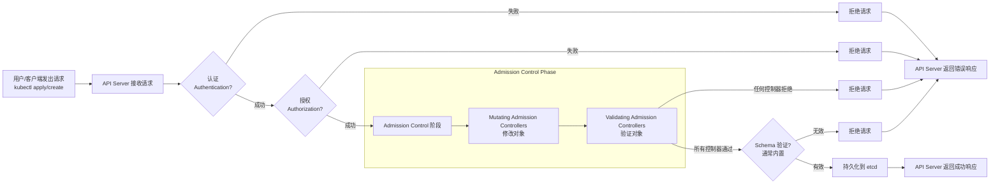

1. AdmissionController原理
- 本质：K8S ApiServer内部的插件
- 目的：在API请求对象（POD,Deployment,Service等）被持久化存储到etcd之前，拦截这些请求
- 作用：对请求执行操作或验证，主要有两类
  - 变更(Mutating)：修改请求对象本身。例如：
    - 为Pod自动注入Sidercar容器（如istio的istio-proxy）
    - 为Pod自动添加特定的标签或注解
    - 修改资源请求/限制
    - 添加存储卷
  - 验证(Validating)：检查请求对象是否符合特定策略，但不修改它。例如：
    - 检查镜像是否来自受信任的仓库
    - 检查Pod是否使用了禁止的安全上下文（如privileged：true）
    - 检查Ingress主机名是否全局唯一
    - 检查资源是否足够
    - 强制执行Pod安全标准（PodSecurity Admission）
- 关键点：Admission Controller在请求的认证（Authentication）和授权（Authorization）的过程之后执行，但在对象写入etcd之前执行。它们是集群安全、策略执行和自动化配置的关键防线


2. AdmissionController流程图
- 一定是先Mutanting再Validating



3. 查看已经启用的AdmissionController
```
kube-apiserver -h | grep enable-admission-plugins
```

4. 怎样新增一个AdmissionController
   1. 创建 Webhook 服务，部署webhook服务到K8S集群
   2. 生成tls证书
   3. 创建ValidatingWebhookConfiguration资源，参考如下
```yaml
# validating-webhook.yaml
apiVersion: admissionregistration.k8s.io/v1
kind: ValidatingWebhookConfiguration
metadata:
  name: pod-name-validator
webhooks:
- name: pod-name-validator.example.com
  rules:
  - apiGroups:   [""]
    apiVersions: ["v1"]
    operations:  ["CREATE", "UPDATE"]
    resources:   ["pods"]
    scope:       "Namespaced"
  clientConfig:
    service:
      namespace: default
      name: admission-webhook
      path: /validate
      port: 443
    caBundle: <base64-encoded-CA-cert>
  admissionReviewVersions: ["v1"]
  sideEffects: None
  timeoutSeconds: 5
```