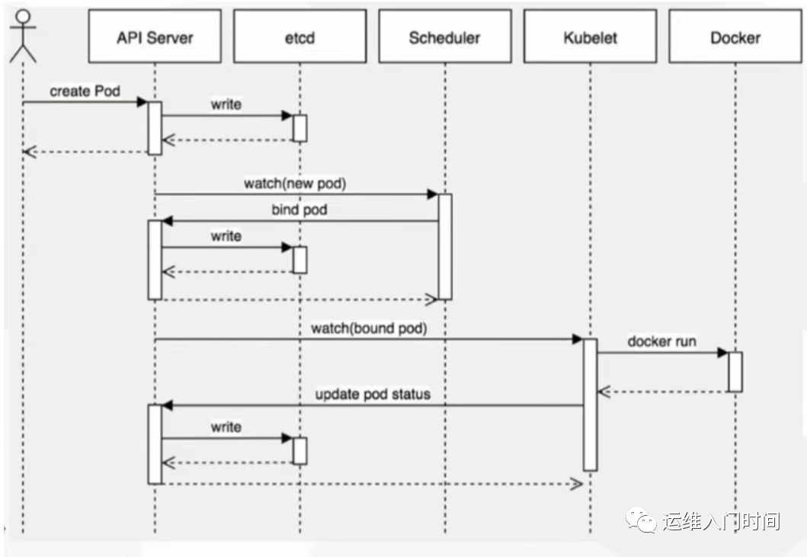

# K8S组件说明
- 控制平面组件
  - API Server：k8s 集群的统一入口，处理 REST 请求（如创建 Pod）。
  - etcd：分布式键值存储，保存集群的所有状态数据（如 Pod 定义、节点信息）。
  - Scheduler：负责 Pod 的调度，根据资源需求和节点状态选择合适的节点。
  - Controller Manager：运行各种控制器（如 ReplicaSet、Deployment 控制器），确保集群状态符合期望。

- 工作节点组件
  - kubelet：节点上的代理，负责运行和管理 Pod。
  - kube-proxy：实现服务的网络代理和负载均衡。
  - Container Runtime：运行容器的软件（如 Docker、containerd、CRI-O）。

# Pod创建的完整流程


## 步骤 1：用户提交 Pod 定义
用户通过 kubectl 或其他客户端工具提交 Pod YAML 到 API Server：
```
kubectl apply -f pod.yaml
```
## 步骤 2：API Server 验证并存储 Pod 定义
- API Server 验证请求的合法性（如语法、权限）。
- 将 Pod 定义存储到 etcd 中（键值格式：/registry/pods/{namespace}/{pod-name}）。
## 步骤 3：Scheduler 调度 Pod 到节点
- Scheduler 监听 API Server 的未调度 Pod（状态为 Pending）。
- 根据资源需求（CPU、内存）、节点亲和性、Taints/Tolerations 等因素，选择最合适的节点。
- 更新 Pod 定义（添加 spec.nodeName 字段），并将结果写回 API Server, API Server将更新的信息写到etcd
## 步骤 4：kubelet 接收并执行 Pod 创建
- 目标节点上的 kubelet 监听 API Server，发现分配给自己的 Pod。
- kubelet 调用 Container Runtime（如 containerd）：
  - 拉取容器镜像。
  - 创建容器并设置资源限制（如 CPU、内存配额）。
  - 挂载 Volume（如 PVC、ConfigMap）。
- kubelet返回pod信息给apiServer，apiServer更新etcd的pod信息
## 步骤 5：kube-proxy 设置网络规则
- kube-proxy 在节点上为 Pod 设置网络规则（通过 iptables 或 IPVS）。
- 确保 Pod 可以通过 ClusterIP 被访问，实现服务发现和负载均衡。
## 步骤 6：容器启动并报告状态
- 容器启动后，kubelet 通过 liveness/probes 监控容器健康状态。
- kubelet 将 Pod 状态（如 Running、Failed）更新到 API Server，最终存储到 etcd。


# 关键组件详细说明

## API Server
- 统一入口：所有组件间的通信都通过 API Server。
- 资源管理：验证并处理对 Pod、Service 等资源的创建、更新、删除请求。
- 数据持久化：将资源状态存储到 etcd，并提供查询接口。
## Scheduler
- 资源感知调度：计算节点资源剩余量，避免过载。
- 亲和性 / 反亲和性：支持 Pod 与节点、Pod 与 Pod 之间的调度约束。
- 污点和容忍度（Taints/Tolerations）：控制 Pod 能否调度到特定节点。
## kubelet
- 节点管家：负责节点上所有 Pod 的生命周期管理。
- 健康检查：执行 liveness 和 readiness 探针，确保容器健康。
- 资源监控：收集 Pod 和容器的资源使用情况（通过 cAdvisor）。
## Container Runtime
- 容器运行时：根据 OCI 标准运行容器（如 Docker、containerd）。
- 镜像管理：拉取、存储和管理容器镜像。
## kube-proxy
- 网络代理：实现 Service 的负载均衡和流量转发。
- 服务发现：通过 DNS 或环境变量为 Pod 提供服务地址解析。