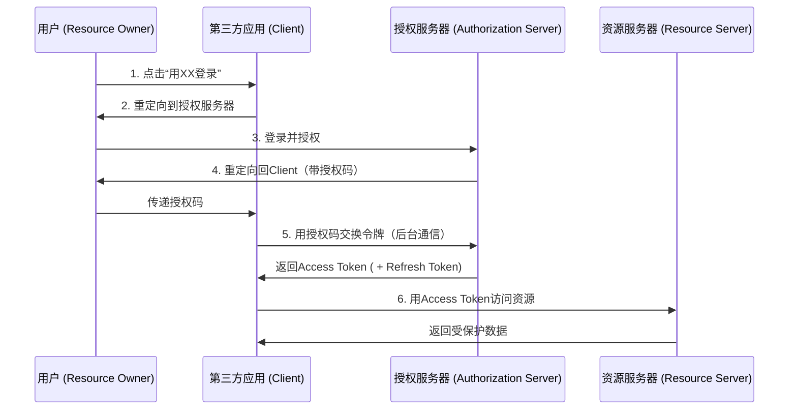

## 时序图



## 具体例子
以用户微信登录知乎为例子

1. 用户发起授权请求
- 用户在知乎点击 “微信登录” 按钮。
- 知乎（第三方应用）将用户重定向到微信的授权端点（Authorization Endpoint），并携带关键参数
```http
https://weixin.com/oauth/authorize?
  response_type=code          // 要求返回授权码
  &client_id=ZHIHU_CLIENT_ID  // 知乎在微信注册的ID
  &redirect_uri=https://zhihu.com/callback // 微信授权后跳回知乎的地址
  &scope=user_info            // 请求的权限范围（如获取用户信息）
  &state=random123             // 防CSRF攻击的随机数
```

2. 用户登录与授权
- 用户被重定向到微信授权服务器的登录页面。
- 用户输入微信账号密码登录（若未登录）。
- 微信展示请求权限（如：“知乎将获取你的头像和昵称”）。
- 用户点击 “允许” 授权知乎访问

3. 授权服务器返回授权码
- 微信授权服务器生成一次性 授权码（Authorization Code）。
- 将用户重定向回知乎指定的 redirect_uri，并携带授权码和 state：
```http
https://zhihu.com/callback?
  code=AUTHORIZATION_CODE_HERE  // 核心授权码
  &state=random123              // 原样返回知乎传入的state
```

4. 第三方应用用授权码交换令牌 ⚠️ 关键安全步骤
- 知乎后端服务（非前端）向微信的令牌端点（Token Endpoint）发起安全 POST 请求，携带：
```http
POST https://weixin.com/oauth/token
Content-Type: application/x-www-form-urlencoded

grant_type=authorization_code
&code=AUTHORIZATION_CODE_HERE   // 上一步获得的授权码
&redirect_uri=https://zhihu.com/callback
&client_id=ZHIHU_CLIENT_ID
&client_secret=ZHIHU_CLIENT_SECRET // 知乎的密钥（仅后端可知！）
```

5. 授权服务器颁发令牌
- 微信授权服务器验证请求合法性（包括 client_secret）。
- 验证通过后，返回 JSON 响应：
```json
{
  "access_token": "ACCESS_TOKEN_HERE",  // 访问令牌
  "token_type": "Bearer",               // 令牌类型
  "expires_in": 3600,                   // 有效期（秒）
  "refresh_token": "REFRESH_TOKEN_HERE", // 刷新令牌（可选）
  "scope": "user_info"                   // 授予的权限范围
}
```

6. 第三方应用访问受保护资源
- 知乎使用获得的 access_token 访问微信资源服务器（如用户信息接口）：
```http
GET https://api.weixin.com/userinfo
Authorization: Bearer ACCESS_TOKEN_HERE
```
- 微信资源服务器验证令牌有效性后，返回用户数据：
```json
{
  "id": "123456",
  "name": "张三",
  "avatar": "https://..."
}
```
- 知乎用此信息创建用户会话，完成登录。