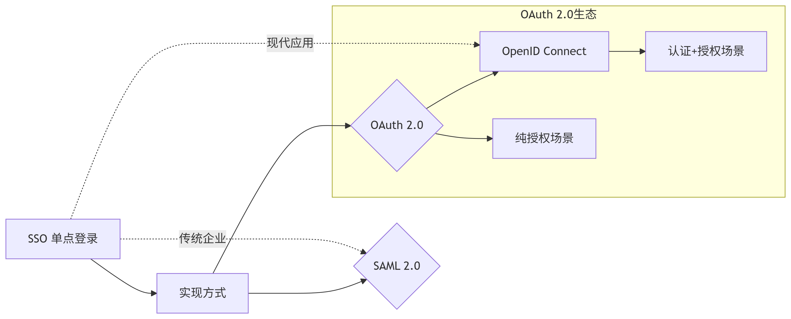

### 1. SSO
Single Sign On (单点登录)
- 定位：单点登录只是登录的**目的**，不是技术协议，而是最终效果，效果是用户只登录一次，就能访问多个互相信任的系统
- 实现方式：SAML, OIDC, OAuth2甚至是传统的cookie、session都可以实现SSO的效果
- 关键价值：减少用户频繁输入密码、集中管理用户身份

### 2. OAuth2
一个用户授权的框架或协议
- 核心目标：解决安全授权问题。允许应用A代表用户U去使用服务B上的资源
- 典型场景：使用微信登录某网站，网站使用了你的微信昵称与头像作为网站的用户信息
- 核心角色：
  - Resource Owner：资源所有者
  - Client: 第三方应用
  - Resource Server: 资源服务器
  - Authorization Server: 授权服务器
- 输出：AccessToken用于访问API获取资源
- 不涉及：用户身份认证（它假设用户已经登录授权服务器）

### 3. OIDC
OpenID Connect
- 本质：基于OAuth 2.0的扩展协议，添加身份认证能力（Authentication）。
- 核心目标：回答“用户是谁？”
在OAuth 2.0授权流程中，额外返回用户身份信息（Claims）。

- 关键创新：
  - ID Token：JWT格式，包含用户身份信息（如ID、邮箱），由授权服务器签名。
  - UserInfo Endpoint：通过Access Token获取更多用户属性。
- 典型场景："用Google账号登录某新闻网站"
  - OAuth 2.0流程获取访问权限 → OIDC扩展返回用户邮箱和姓名。
- 与OAuth 2.0关系：
  - OIDC = OAuth 2.0 + ID Token + 标准化的用户信息端点 + 认证流程规范。

